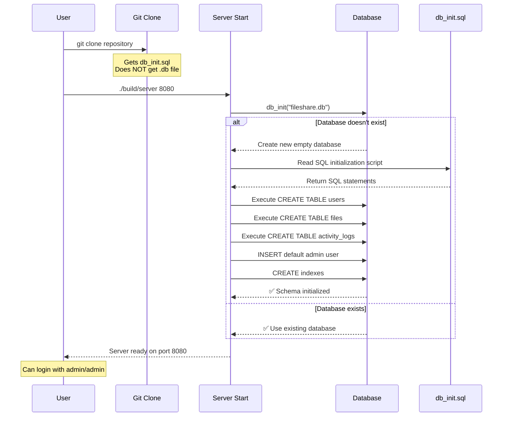

# Clone and Run - Database Initialization Explained

## The Answer: **YES, They Can Connect!** ✅

Your project has **automatic database initialization**. The `.db` file is NOT needed in git.

## How It Works



## File Status

| File | In Git? | Purpose | Created When |
|------|---------|---------|--------------|
| `src/database/db_init.sql` | ✅ Yes | SQL initialization | Developer commits |
| `fileshare.db` | ❌ No | Runtime database | Server first run |
| `fileshare.db-shm` | ❌ No | SQLite shared mem | Server runtime |
| `fileshare.db-wal` | ❌ No | SQLite write log | Server runtime |
| `storage/*` | ❌ No | Uploaded files | File uploads |

## Database Initialization Code

### Server Main (src/server/main.c)

```c
// Line 47-58: Automatic database initialization
global_db = db_init("fileshare.db");
if (!global_db) {
    log_error("Failed to initialize database");
    return 1;
}

// Initialize database schema
if (db_init_schema(global_db, "src/database/db_init.sql") < 0) {
    log_error("Failed to initialize database schema");
    db_close(global_db);
    return 1;
}
```

### db_init.sql Contents

```sql
-- Creates tables
CREATE TABLE IF NOT EXISTS users (...);
CREATE TABLE IF NOT EXISTS files (...);
CREATE TABLE IF NOT EXISTS activity_logs (...);

-- Creates default admin (password: "admin")
INSERT OR IGNORE INTO users (id, username, password_hash, is_admin)
VALUES (1, 'admin', '8c6976e5b5410415bde908bd4dee15dfb167a9c873fc4bb8a81f6f2ab448a918', 1);

-- Creates root directory
INSERT OR IGNORE INTO files (id, parent_id, name, owner_id, is_directory, permissions)
VALUES (0, -1, '/', 0, 1, 755);
```

## What Users Get When They Clone

### ✅ Included in Repository
- Source code (`.c`, `.h` files)
- Database initialization script (`db_init.sql`)
- Build system (`Makefile`)
- Documentation

### ❌ NOT Included (Auto-Created)
- Database file (`.db`)
- Storage directory with uploaded files
- Server logs
- Compiled binaries

## Step-by-Step: What Happens

### 1. User Clones Repository
```bash
git clone <your-repo>
cd networkFinal
```

**Gets:**
- `src/database/db_init.sql` ✅
- All source code ✅

**Does NOT get:**
- `fileshare.db` ❌ (in .gitignore)

### 2. User Builds
```bash
make
```

**Creates:**
- `build/server`
- `build/client`
- `build/gui_client` (if GTK4 available)

### 3. User Runs Server
```bash
./build/server 8080
```

**Server automatically:**
1. Creates `fileshare.db` (new empty SQLite database)
2. Reads `src/database/db_init.sql`
3. Executes all SQL statements:
   - CREATE TABLE users
   - CREATE TABLE files
   - CREATE TABLE activity_logs
   - INSERT default admin user
   - CREATE indexes
4. Server ready!

### 4. User Connects
```bash
./build/client 127.0.0.1 8080
login admin admin
```

**Works immediately!** ✅

## Verification Script

Save as `verify_setup.sh`:

```bash
#!/bin/bash

echo "🔍 Verifying Repository Setup"
echo "=============================="

# Check if db_init.sql is tracked
if git ls-files --error-unmatch src/database/db_init.sql &>/dev/null; then
    echo "✅ db_init.sql is tracked in git"
else
    echo "❌ ERROR: db_init.sql not in git!"
    exit 1
fi

# Check if .db files are ignored
if git check-ignore -q fileshare.db; then
    echo "✅ .db files are ignored (not pushed to git)"
else
    echo "⚠️  WARNING: .db files might be tracked!"
fi

# Check if initialization script has default admin
if grep -q "INSERT OR IGNORE INTO users" src/database/db_init.sql; then
    echo "✅ Default admin user will be created"
else
    echo "❌ ERROR: No default admin in db_init.sql!"
    exit 1
fi

echo ""
echo "✅ Setup is correct!"
echo ""
echo "Users who clone will:"
echo "  1. Get db_init.sql ✓"
echo "  2. NOT get your .db file ✓"
echo "  3. Auto-create database on first run ✓"
echo "  4. Can login with admin/admin ✓"
```

## Testing the Clone Experience

To test what users will experience:

```bash
# 1. Simulate fresh clone (in a test directory)
mkdir test_clone
cd test_clone
git clone <your-repo> .

# 2. Verify no database exists
ls -la *.db
# Should show: No such file or directory

# 3. Build
make

# 4. Run server
./build/server 8080

# 5. Check for automatic database creation
ls -la fileshare.db
# Should show: fileshare.db created

# 6. Verify default admin exists
sqlite3 fileshare.db "SELECT username, is_admin FROM users;"
# Should show: admin|1

# 7. Test connection
./build/client 127.0.0.1 8080
login admin admin
# Should work!
```

## Summary Table

| Question | Answer |
|----------|--------|
| Can they connect without .db file? | ✅ YES |
| Do they need to create database manually? | ❌ NO - Automatic |
| What do they need from git? | Source code + db_init.sql |
| Will default admin exist? | ✅ YES - Auto-created |
| Can they login immediately? | ✅ YES - admin/admin |
| Do they need extra setup? | ❌ NO - Just build & run |

## Your .gitignore is Correct

```gitignore
*.db           ✅ Database files ignored
*.db-journal   ✅ SQLite journals ignored
storage/       ✅ Uploaded files ignored
*.log          ✅ Log files ignored
```

## Your db_init.sql is Tracked

```bash
$ git ls-files | grep db_init
src/database/db_init.sql  ✅ Tracked and pushed
```

## Conclusion

🎉 **Your setup is PERFECT!**

- ✅ Database auto-initializes
- ✅ Default admin auto-created
- ✅ No manual setup needed
- ✅ Users can clone and run immediately
- ✅ Everyone gets the same starting state

**Share your repository with confidence!** Everyone who clones it will be able to:
1. Build the project
2. Run the server
3. Connect with the client
4. Login with admin/admin

No database file needed in git! 🚀
