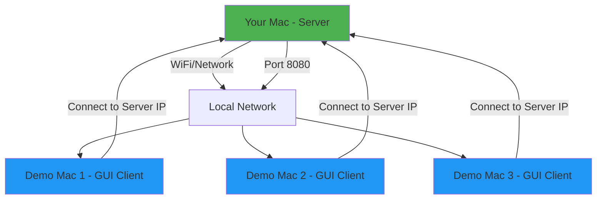

# Network File Manager - Demo Setup Guide

Quick guide for demonstrating your project with GUI clients connecting to your server.

## Demo Architecture



## Before the Demo: Server Setup (5 Minutes)

### Choose Your Deployment Method

**Option A: Docker (Recommended)** - Easier, more reliable, isolated environment
**Option B: Native** - Direct execution, shows live compilation

### Option A: Docker Deployment (Recommended)

**1. Find Your Server IP Address**

```bash
# On your Mac (server), run:
ifconfig | grep "inet " | grep -v 127.0.0.1
```

You'll see something like:
```
inet 192.168.1.100 netmask 0xffffff00 broadcast 192.168.1.255
```

**Your server IP:** `192.168.1.100` (write this down!)

**2. Start Server with Docker**

```bash
cd /Users/minhbohung111/workspace/projects/networkFinal

# First time: Build Docker image (takes 2-3 minutes)
make docker-build

# Start server
make docker-run
```

You should see:
```
✓ Container started: fileshare-server
✓ Server accessible at localhost:8080
```

**Check it's running:**
```bash
make docker-status
# Should show: Up X seconds    0.0.0.0:8080->8080/tcp
```

**View server logs:**
```bash
make docker-logs
```

**Keep server running!** (No need to keep terminal open - runs in background)

### Option B: Native Deployment

**1. Find Your Server IP Address**

```bash
# On your Mac (server), run:
ifconfig | grep "inet " | grep -v 127.0.0.1
```

You'll see something like:
```
inet 192.168.1.100 netmask 0xffffff00 broadcast 192.168.1.255
```

**Your server IP:** `192.168.1.100` (write this down!)

**2. Start the Server**

```bash
cd /Users/minhbohung111/workspace/projects/networkFinal
./build/server 8080
```

You should see:
```
Server started on port 8080
Database schema initialized
Waiting for connections...
```

**Keep this terminal open!**

### 3. Allow Firewall Access (First Time Only)

**For Docker:** Docker Desktop handles this automatically

**For Native:**
If macOS asks about firewall, click **"Allow"**

Or manually add:
```bash
sudo /usr/libexec/ApplicationFirewall/socketfilterfw --add ./build/server
sudo /usr/libexec/ApplicationFirewall/socketfilterfw --unblock ./build/server
```

### 4. Verify Server is Accessible

From another terminal on the same Mac:
```bash
nc -zv localhost 8080
# Should show: Connection to localhost port 8080 [tcp/http-alt] succeeded!
```

**For Docker, also check:**
```bash
make docker-status
# Should show container is "Up"
```

## Before the Demo: Client Setup

### Option A: Pre-Install GUI Client on Demo Machines

**1-2 days before demo:**

1. **Transfer NetworkFileManager.dmg** to each demo Mac via:
   - USB drive
   - AirDrop
   - Cloud storage (Google Drive, Dropbox)

2. **On each demo Mac**, have them run:
   ```bash
   # Install GTK4
   brew install gtk4

   # Copy app to Applications
   # (Drag from DMG)

   # Remove quarantine
   sudo xattr -cr /Applications/NetworkFileManager.app
   ```

3. **Test before demo day:**
   ```bash
   # On demo Mac, test connection
   /Applications/NetworkFileManager.app/Contents/MacOS/NetworkFileManager
   ```

### Option B: Live Installation During Demo (Risky!)

Only if you want to show the setup process. Otherwise, use Option A.

## Demo Day: Connection Steps

### For Demo Machine Users

**Step 1: Launch App**
```bash
# Either double-click in Applications
# Or run from terminal:
open /Applications/NetworkFileManager.app
```

**Step 2: Enter Connection Details**

| Field | Value | Example |
|-------|-------|---------|
| **Server IP** | Your server IP | `192.168.1.100` |
| **Port** | `8080` | `8080` |

**Step 3: Login**

| Field | Value |
|-------|-------|
| **Username** | `admin` |
| **Password** | `admin` |

**Step 4: Start Demo!**

## Demo Checklist

### 30 Minutes Before Demo

- [ ] Server Mac connected to WiFi
- [ ] Find server IP address
- [ ] Start server:
  - **Docker:** `make docker-run` (recommended)
  - **Native:** `./build/server 8080`
- [ ] Verify server running:
  - **Docker:** `make docker-status`
  - **Native:** Check terminal shows "Waiting for connections..."
- [ ] Demo Macs connected to same WiFi
- [ ] GUI clients pre-installed on demo Macs
- [ ] Test connection from one demo Mac

### 10 Minutes Before Demo

- [ ] Verify all demo Macs can reach server:
  ```bash
  nc -zv 192.168.1.100 8080  # Use your actual IP
  ```
- [ ] Have server IP written on whiteboard/slide
- [ ] Keep server terminal visible (shows connections)
- [ ] Prepare demo data (files to upload/download)

### During Demo

**Show these features:**

1. **Multi-client connections**
   - Connect 2-3 clients simultaneously
   - Server terminal shows each connection

2. **File upload**
   - Client 1: Upload a file
   - Show it appears for all clients

3. **Directory operations**
   - Create folders
   - Navigate directories

4. **File search**
   - Search with wildcards (`*.txt`)
   - Show recursive search

5. **Drag & drop**
   - Move files between folders

6. **Permissions**
   - Show file ownership
   - Admin can manage users

7. **Real-time updates**
   - One client uploads
   - Other clients refresh and see it

## Quick Connection Info Card

Create this card for demo attendees:

```
═══════════════════════════════════════
  NETWORK FILE MANAGER - DEMO
═══════════════════════════════════════

Server IP:   192.168.1.100  ← Update this!
Port:        8080

Login:
Username:    admin
Password:    admin

Features to try:
• Upload/download files
• Create directories
• Search files (*.txt)
• Drag & drop files
• Right-click menu

═══════════════════════════════════════
```

## Demo Script

### Introduction (1 minute)

> "This is a network file management system with a GUI client built in GTK4 for macOS. Multiple clients can connect simultaneously to share and manage files."

### Live Demo (4 minutes)

**1. Connection (30 seconds)**
- Show server terminal with IP
- Launch GUI client
- Enter connection details
- Login successful

**2. File Operations (1 minute)**
- Upload a file
- Create a directory
- Navigate folders
- Show file list with owner info

**3. Multi-Client (1 minute)**
- Connect second client (different Mac)
- Show both can see same files
- One client uploads, other refreshes

**4. Search (30 seconds)**
- Use search with wildcard pattern
- Show results

**5. Advanced Features (1 minute)**
- Drag & drop file moving
- Right-click context menu
- Admin dashboard (user management)

### Q&A (5 minutes)

## Troubleshooting During Demo

### Issue: Client Can't Connect

**Quick Fix:**
```bash
# On client Mac:
ping 192.168.1.100  # Test network connectivity

# On server Mac:
lsof -i :8080  # Verify server is running
```

**Common causes:**
- Different WiFi networks
- Firewall blocking
- Wrong IP address
- Server not running

### Issue: "Damaged" App Error

**Quick Fix:**
```bash
sudo xattr -cr /Applications/NetworkFileManager.app
```

### Issue: GTK4 Error

**Quick Fix:**
```bash
brew install gtk4
```

### Issue: Server Crashes

**Quick Restart:**
```bash
cd /Users/minhbohung111/workspace/projects/networkFinal
./build/server 8080
```

## Network Requirements

### Same WiFi Network (Recommended)

✅ **Easiest setup**
- All devices on same WiFi
- Server and clients can see each other
- No router configuration needed

**Example:**
- University WiFi: "Campus-WiFi"
- All devices connected to "Campus-WiFi"

### Different Networks (Advanced)

⚠️ **Requires port forwarding**
- Not recommended for demos
- Need router access
- Firewall complications

## Demo Environment Options

### Option 1: Bring Your Own Devices

**Pros:**
- Full control
- Pre-configured
- No dependency on venue

**Setup:**
- Your Mac as server
- 2-3 additional Macs as clients
- Personal hotspot or venue WiFi

### Option 2: Use Venue Equipment

**Pros:**
- No carrying multiple devices
- Show real-world deployment

**Setup Required:**
- Pre-install on venue Macs
- Test connectivity before demo
- Backup plan if WiFi fails

### Option 3: Hybrid

**Pros:**
- Best of both worlds

**Setup:**
- Your Mac as server
- Your Mac as client 1 (localhost)
- Venue Mac as client 2

## Backup Plans

### Plan B: Localhost Demo

If network fails:

```bash
# Server and client on same Mac
# Terminal 1: Start server
./build/server 8080

# Terminal 2: Start client
./build/gui_client
# Connect to: 127.0.0.1:8080
```

### Plan C: Video Demo

Pre-record a video showing:
- Multi-client connections
- File operations
- Real-time updates

### Plan D: Architecture Presentation

Show:
- System design diagrams
- Protocol specifications
- Code highlights
- Screenshots of GUI

## Post-Demo

### Cleanup

**Docker:**
```bash
# Stop server
make docker-stop

# Optional: Clear demo data
rm -rf data/* storage/*

# Restart will recreate fresh database
make docker-run
```

**Native:**
```bash
# Stop server
# Press Ctrl+C in server terminal

# Optional: Clear demo data
rm -rf storage/*
rm fileshare.db

# Restart will recreate fresh database
./build/server 8080
```

### Share with Attendees

Provide:
- GitHub repository link
- DMG download link
- Setup documentation
- Your contact info

## Quick Reference Commands

### Server Side

**Docker:**
```bash
# Find IP
ifconfig | grep "inet " | grep -v 127.0.0.1

# Start server
make docker-run

# Check status
make docker-status

# View logs
make docker-logs

# Stop server
make docker-stop

# Restart server
make docker-restart
```

**Native:**
```bash
# Find IP
ifconfig | grep "inet " | grep -v 127.0.0.1

# Start server
./build/server 8080

# Check connections
lsof -i :8080

# View logs
tail -f server.log
```

### Client Side

```bash
# Install GTK4
brew install gtk4

# Remove quarantine
sudo xattr -cr /Applications/NetworkFileManager.app

# Launch GUI
open /Applications/NetworkFileManager.app

# Test connection
nc -zv 192.168.1.100 8080
```

## Demo Success Metrics

✅ **Successful Demo Includes:**
- [ ] At least 2 clients connected simultaneously
- [ ] Successful file upload/download
- [ ] Directory operations demonstrated
- [ ] Search functionality shown
- [ ] No crashes or freezes
- [ ] Q&A handled confidently

## Final Checklist

**Day Before Demo:**
- [ ] Test full demo flow
- [ ] Charge all devices
- [ ] Prepare demo files
- [ ] Print connection info cards
- [ ] Test venue WiFi (if possible)

**Demo Day Morning:**
- [ ] Arrive early
- [ ] Setup and test connectivity
- [ ] Run through demo once
- [ ] Have backup plans ready

**During Demo:**
- [ ] Stay calm
- [ ] Explain what you're doing
- [ ] Show enthusiasm
- [ ] Answer questions honestly

**After Demo:**
- [ ] Thank attendees
- [ ] Share resources
- [ ] Get feedback

Good luck with your demo! 🎉
