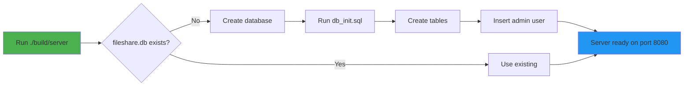

# Network File Manager - Setup from Git Clone

This guide is for users who clone the repository and want to run the server.

## Prerequisites

- macOS or Linux
- C compiler (GCC or Clang)
- Make
- GTK+ 4 (for GUI client only)

## Quick Setup (5 Minutes)

### 1. Clone the Repository

```bash
git clone <repository-url>
cd networkFinal
```

### 2. Build Everything

```bash
# Build server and CLI client
make

# Build GUI client (optional - requires GTK4)
make -C src/client/gui
```

### 3. Run the Server

```bash
./build/server 8080
```

**That's it!** The server will automatically:
- Create a new database (`fileshare.db`)
- Initialize all tables
- Create a default admin account

## Default Credentials

After first run, you can login with:

```
Username: admin
Password: admin
```

⚠️  **Change the admin password immediately after first login!**

## What Happens on First Run?



## File Structure After Setup

```
networkFinal/
├── fileshare.db          ← Created automatically (not in git)
├── storage/              ← Created automatically
├── server.log            ← Created automatically
├── build/
│   ├── server            ← Built from source
│   ├── client            ← Built from source
│   └── gui_client        ← Built from source (optional)
└── src/
    └── database/
        └── db_init.sql   ← In git, used for initialization
```

## Connect with CLI Client

```bash
# On the same machine
./build/client 127.0.0.1 8080

# Login
login admin admin

# Start using commands
ls
mkdir test
upload localfile.txt
```

## Connect with GUI Client

```bash
# Launch GUI (requires GTK4)
./build/gui_client

# In the GUI:
# 1. Enter server IP: 127.0.0.1
# 2. Enter port: 8080
# 3. Click Connect
# 4. Login with admin/admin
```

## For Remote Connections

If clients are connecting from other machines:

1. **Find your server IP**:
   ```bash
   ifconfig | grep "inet " | grep -v 127.0.0.1
   ```

2. **Allow firewall access** (if needed):
   ```bash
   # macOS
   sudo /usr/libexec/ApplicationFirewall/socketfilterfw --add ./build/server
   ```

3. **Clients connect to**:
   ```
   Server IP: <your-ip-address>
   Port: 8080
   ```

## Database Initialization Details

The `src/database/db_init.sql` file creates:

### Tables
- **users**: User accounts and authentication
- **files**: Virtual file system metadata
- **activity_logs**: Audit trail

### Default Data
- **Admin user**: username=`admin`, password=`admin` (SHA256 hashed)
- **Root directory**: Virtual filesystem root

### Indexes
- Optimized for file listing, search, and owner queries

## Troubleshooting

### Issue: "Failed to initialize database"

**Cause**: Cannot create database file

**Solution**:
```bash
# Check write permissions
ls -la .
chmod +w .
```

### Issue: "Failed to initialize database schema"

**Cause**: Cannot find `db_init.sql`

**Solution**:
```bash
# Run server from project root, not from build/
cd /path/to/networkFinal
./build/server 8080
```

### Issue: "Permission denied" on port 8080

**Cause**: Port already in use or needs root

**Solution**:
```bash
# Use different port
./build/server 8888

# Or check what's using port 8080
lsof -i :8080
```

### Issue: Client cannot login

**Cause**: Database not initialized

**Solution**:
```bash
# Stop server
# Delete database
rm fileshare.db

# Restart server (will recreate)
./build/server 8080
```

## Database Reset

To start fresh:

```bash
# Stop the server first (Ctrl+C)

# Delete database and storage
rm fileshare.db
rm -rf storage/*

# Restart server
./build/server 8080

# Database will be recreated with default admin
```

## Creating Additional Users

After logging in as admin:

### Using CLI Client
```bash
# Login as admin
login admin admin

# Create new user (admin only)
user_create johndoe password123
```

### Using GUI Client
1. Login as admin
2. Click "Admin" menu
3. Select "User Management"
4. Click "Create User"
5. Enter username and password

## Security Notes

1. **Change default password**: The default `admin/admin` credentials should be changed immediately
2. **Database location**: `fileshare.db` is ignored by git (contains user passwords)
3. **Password storage**: Passwords are SHA256 hashed
4. **File permissions**: Unix-style permissions (rwx) are enforced
5. **Activity logging**: All actions are logged in `activity_logs` table

## Port Configuration

Default port is 8080. To use a different port:

```bash
# Server
./build/server 3000

# CLI Client
./build/client 127.0.0.1 3000

# GUI Client: Enter 3000 in port field
```

## System Requirements

### Server
- macOS 10.13+ or Linux
- 100 MB free disk space
- Network connectivity

### Client (CLI)
- macOS 10.13+ or Linux
- Network connectivity to server

### Client (GUI)
- macOS 10.13+ or Linux
- GTK+ 4 installed
- Network connectivity to server

## What's NOT in Git (Created at Runtime)

These files are automatically created and are in `.gitignore`:

- `fileshare.db` - User database
- `fileshare.db-shm` - SQLite shared memory
- `fileshare.db-wal` - SQLite write-ahead log
- `storage/*` - Uploaded files
- `server.log` - Server logs
- `build/*` - Compiled binaries

## Advanced: Custom Database Location

To use a custom database file:

1. **Edit `src/server/main.c` line 47**:
   ```c
   global_db = db_init("custom_path/mydb.db");
   ```

2. **Rebuild**:
   ```bash
   make clean
   make
   ```

## Getting Help

- **Server issues**: Check `server.log`
- **Build issues**: Ensure dependencies installed
- **Connection issues**: Check firewall and IP address
- **Database issues**: Try resetting (delete `fileshare.db` and restart)

## Summary

✅ **Database is auto-initialized** - No manual setup required
✅ **Default admin created** - Login with `admin/admin`
✅ **Works immediately** - Just build and run
✅ **No .db file in git** - Created fresh on each setup

You can safely share the repository. Everyone who clones it will get a working system with automatic database initialization.
