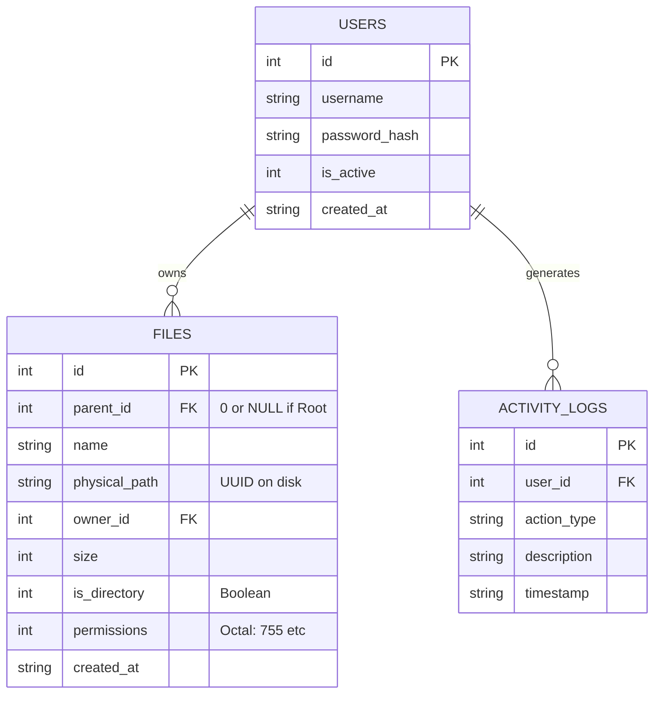
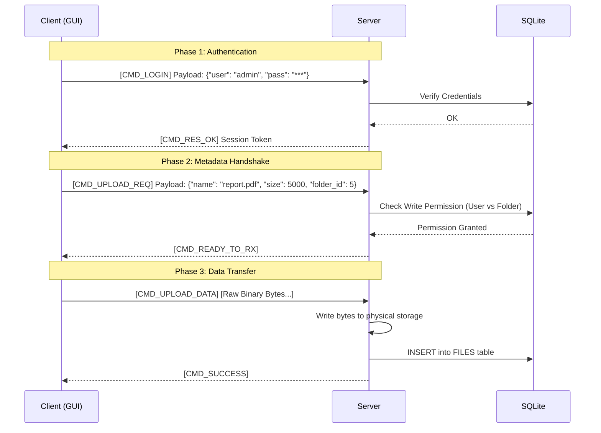

Here is the comprehensive design document for the File Sharing System, formatted in Markdown.

-----

# System Design Document: Linux C File Sharing System

**Role:** Senior Solution Architect
**Scope:** Client-Server File Sharing Application
**Technology Stack:** C (Linux Sockets), SQLite, TCP/IP
**Key Features:** User Management, File/Folder Operations (FTP-like), Permissions (Linux-style), Activity Logging.

-----

## 1\. High-Level System Architecture

The system follows a classic **Client-Server** model. The server acts as a daemon running on Linux, managing concurrent connections via multi-threading. The client acts as the presentation layer (GUI).

### System Context Diagram

```mermaid
graph TD
    User((User)) -->|Interacts| GUI[Client GUI Application]
    GUI -->|TCP / Custom Protocol| Server[Server Daemon (C Linux)]
    
    subgraph "Server Environment"
        Server -->|SQL Queries| DB[(SQLite Database)]
        Server -->|File I/O| FS[Physical File System]
        Server -->|Append| Log[Activity Log File]
    end
```

### Architectural Decisions

1.  **Transport Layer:** **TCP** is chosen over UDP for guaranteed delivery of file data and command integrity.
2.  **Concurrency Model:** **Thread-per-client** (using `pthread`). This is simpler to implement than `select`/`epoll` for handling blocking database and file I/O operations in a custom protocol.
3.  **Storage Strategy:** \* **Metadata (Virtual FS):** Stored in SQLite (filenames, folder structure, permissions).
      * **Payload (Physical FS):** Stored in a flat or hashed directory structure on the server disk to avoid filesystem complexity (e.g., `storage/uuid_of_file`).

-----

## 2\. Database Design (SQLite)

We use a relational schema to map the "Virtual File System" seen by the user to the physical files on the disk, and to manage permissions.

### Schema Definition



### Key Logic

  * **Permissions:** Stored as an integer representing the standard Unix bitmask (e.g., `7` for RWX).
  * **Directory Traversal:** To list files in a folder, we query `SELECT * FROM files WHERE parent_id = ?`.

-----

## 3\. Protocol Design

A hybrid **Binary Header + Variable Payload** protocol is designed to handle both control commands (login, mkdir) and data streams (file upload) efficiently.

### Packet Structure

Every message exchanged between Client and Server follows this format:

| Byte Offset | Field | Size | Description |
| :--- | :--- | :--- | :--- |
| 0 | **Magic** | 2 Bytes | `0xFA 0xCE` (Sync marker) |
| 2 | **Command** | 1 Byte | ID of the action (see below) |
| 3 | **Data Length** | 4 Bytes | Unsigned Int (Size of payload) |
| 7 | **Payload** | Variable | JSON metadata or Raw File Bytes |

### Command ID List

  * `0x01`: Login Request
  * `0x02`: Login Response
  * `0x10`: List Directory (ls)
  * `0x11`: Change Directory (cd)
  * `0x12`: Make Directory (mkdir)
  * `0x20`: Upload Request (metadata)
  * `0x21`: Upload Data (binary)
  * `0x30`: Download Request

### Sequence Diagram: File Upload Flow



-----

## 4\. Component Logic & State Machine

The server must handle state transitions carefully to prevent unauthorized access (e.g., trying to upload a file before logging in).

### Server State Machine (Per Thread)

```mermaid
stateDiagram-v2
    [*] --> WAIT_CONN
    WAIT_CONN --> AUTH_PENDING : accept()
    
    state AUTH_PENDING {
        [*] --> VERIFYING
        VERIFYING --> LOGGED_IN : Valid Credentials
        VERIFYING --> AUTH_PENDING : Invalid (Retry)
        VERIFYING --> DISCONNECT : Max Retries Exceeded
    }

    state LOGGED_IN {
        [*] --> IDLE
        IDLE --> PROCESSING : Command Received
        PROCESSING --> IDLE : Task Complete
        PROCESSING --> TRANSFERRING : Large File I/O
        TRANSFERRING --> IDLE : EOF / Error
    }

    LOGGED_IN --> DISCONNECT : Logout Cmd
    DISCONNECT --> [*]
```

### Permission Logic (Linux Style)

We will implement a helper function in C to mimic `chmod` logic.

  * **Read (4):** Allowed to Download or List files.
  * **Write (2):** Allowed to Upload, Mkdir, or Delete.
  * **Execute (1):** Allowed to Enter (`cd`) the directory.

-----

## 5\. Implementation Strategy (C Linux)

### Socket & System Calls

1.  **Socket Setup:**

    ```c
    int server_fd = socket(AF_INET, SOCK_STREAM, 0);
    struct sockaddr_in address;
    address.sin_family = AF_INET;
    address.sin_addr.s_addr = INADDR_ANY; 
    address.sin_port = htons(PORT);
    bind(server_fd, (struct sockaddr *)&address, sizeof(address));
    listen(server_fd, 10);
    ```

2.  **Thread Pool / Handling:**
    Use `<pthread.h>`. When `accept()` returns a new `client_socket`, allocate a `struct ClientSession` and pass it to `pthread_create`.

3.  **Synchronization:**

      * **SQLite:** By default, SQLite is thread-safe in "Serialized" mode, but it is better practice to use a **Mutex** around database writes to prevent locking errors.
      * **Logging:** A global mutex `pthread_mutex_lock(&log_mutex)` is required when writing to the text log file to prevent interleaved lines.

4.  **Folder Upload (Recursive):**
    This is primarily **Client-side logic**.

    1.  Client GUI selects a folder.
    2.  Client code traverses the folder tree.
    3.  For every directory found $\rightarrow$ Send `CMD_MKDIR`.
    4.  For every file found $\rightarrow$ Send `CMD_UPLOAD`.

### Logging Activation

The system acts as a "tracker". Every successful `accept()` + `login` sequence should trigger a log entry.

**Log Format (`server.log`):**

```text
[2023-10-27 10:00:01] [INFO] User 'alice' logged in from IP 192.168.1.5
[2023-10-27 10:05:20] [ACTION] User 'alice' uploaded 'project.zip' (Size: 10MB)
```

-----

